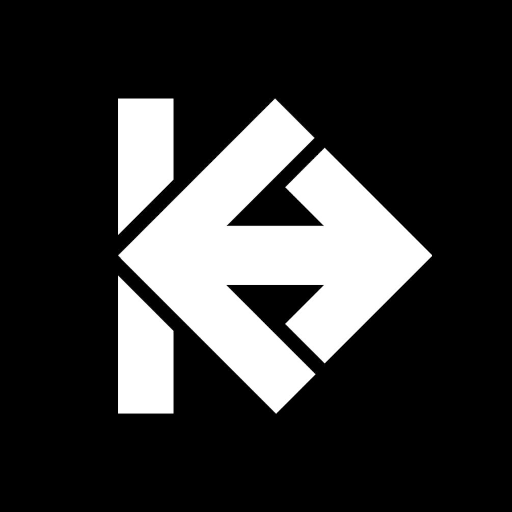
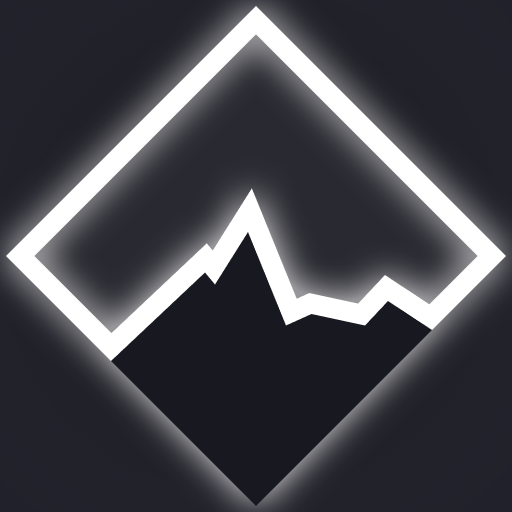
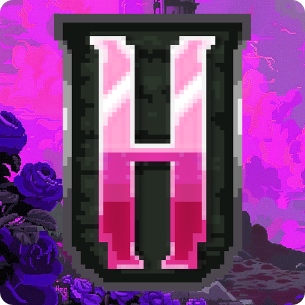
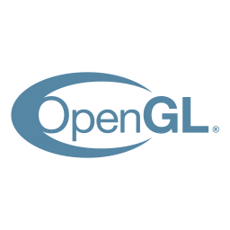
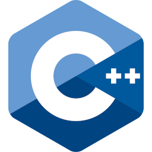
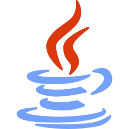
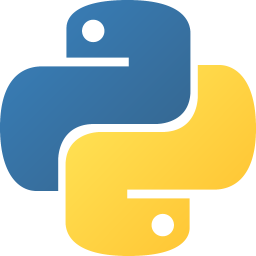

  

> ^ GLSL
<h1 align="center">- whoami -</h1>

CS student @ UCU (3rd year)

  
  

<h1 align="center">- projects -</h1>

<ul style="list-style:none;padding:0;">

<li>

###  <a href="https://github.com/llevttarr/khors-ray-tracer">KHORS</a>

Hardware-accelerated ray-tracing engine that utilizes ReSTIR Direct Illumination

</li>
<li>

### <a href="https://github.com/llevttarr/rt-video-decomposition">Real-Time Background Decomposition</a>

Computer vision application for removing the background using linear algebra techniques

</li>
<li>

### <a href="https://github.com/rasthpop/arkan_POC">ARKAN</a>

GPS Radio-coordinator system

</li>
<li>

###  <a href="https://github.com/llevttarr/fsmt-gen">FSMTgen</a>

Visualization app of different terrain-generation algorithms

</li>
<li>

### <a href="https://github.com/llevttarr/slow-hills">Slow Hills</a>

Procedural terrain generation sandbox website

</li>
<li>

### <a href="https://github.com/llevttarr/mpi_heatc">Heat Conductivity Simulation</a>

Heat conductivity simulation using various parallelism techniques

</li>
<li>

###  <a href="https://youtube.com/@nulifie">Nulifie</a>

Was the lead technical developer 

</li>
</ul>
<h1 align="center">- skillset -</h1>

## Languages

  
  
  

## Graphics / Rendering

  
  
  
  
  
  <!--  -->

## Tools

  
  
  

<!-- <table align="center">
  <tr>
    <td align="center">
      
        
      
      
    </td>
    <td align="center">
      
        
      
      
    </td>
    <td align="center">
      
        
      
      
    </td>
  </tr>
</table> -->
<!--
# leetcode

  

-->
